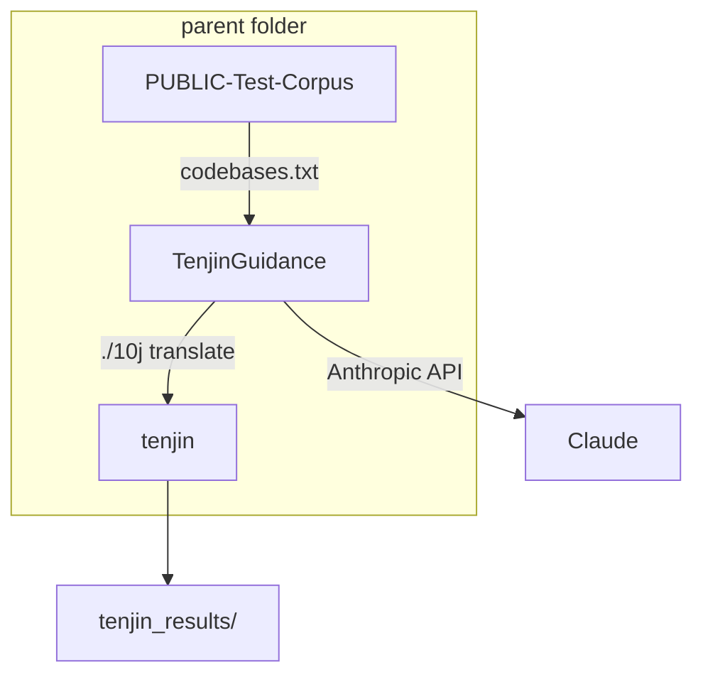

# TenjinGuidance

TenjinGuidance orchestrates **LLM-guided C→Rust translation** by analyzing C code, asking Claude for type and mutability hints, and passing that guidance to [Tenjin](../tenjin/). It then checks translated Rust with `cargo check` and records quality metrics. The CLI still prints **Tractor** in mode messages for brevity.

## Repository layout

Place these three directories as **siblings** under one parent (the parent name does not matter):

```
<parent>/
  TenjinGuidance/         # this project
  tenjin/                  # 10j CLI + c2rust fork
  PUBLIC-Test-Corpus/      # benchmark C projects
```



| Path | Purpose |
|------|---------|
| `src/` | Pipeline: C analysis, LLM prompts, Tenjin invocation, metrics |
| `prompts/` | LLM system prompts for types, mutability, return types |
| `codebases/` | Lists of C targets (`codebases.txt`) |
| `c_samples/` | Small `.c` files for local development |
| `tenjin_results/` | Guided translation outputs (`--guided`; created at run time) |
| `tenjin_baseline/` | Baseline Tenjin outputs without LLM guidance (`--tenjinize-only`) |

See [src/README.md](src/README.md) for module-level detail.

### Clone sibling repositories

From your parent directory (alongside TenjinGuidance):

```bash
git clone git@github.com:Aarno-Labs/tenjin.git
git clone git@github.com:DARPA-TRACTOR-Program/PUBLIC-Test-Corpus.git
```

The corpus checkout must be named `PUBLIC-Test-Corpus` so paths in `codebases/codebases.txt` resolve correctly.

## Setup

### 1. Tenjin

```bash
cd ../tenjin/cli
./10j provision
```

Add `tenjin/cli` to your `PATH`, or TenjinGuidance will invoke `./10j` from that directory automatically (sibling layout required).

### 2. TenjinGuidance Python environment

```bash
cd TenjinGuidance
python3 -m venv .venv
source .venv/bin/activate
pip install -r requirements.txt
```

### 3. C analysis (libclang) — macOS or Linux

TenjinGuidance uses Python `libclang` to analyze `.c` files before LLM guidance. Paths are **auto-detected** on both platforms; override with `LIBCLANG_PATH` in `.env` if needed (see `.env.example`).

#### macOS

```bash
xcode-select --install          # Command Line Tools (provides xcrun + system headers)
brew install llvm               # libclang shared library
```

Auto-detected library paths: `/opt/homebrew/opt/llvm/lib` (Apple Silicon) or `/usr/local/opt/llvm/lib` (Intel).

#### Linux (Debian/Ubuntu)

```bash
sudo apt update
sudo apt install -y clang llvm libclang-dev build-essential
```

Auto-detected paths include `/usr/lib/llvm-*/lib` and locations reported by `llvm-config --libdir`. Ensure `clang` is on your `PATH`.

#### Verify

```bash
source .venv/bin/activate
python3 src/guidance.py --analyze-only --max-items 3
```

You should see a line like `libclang: /usr/lib/llvm-18/lib (linux)` and variable counts for each `.c` file—not `xcrun` errors.

#### Guided / Tenjin runs also need

- **Rust** (`rustup` / `cargo`) for `cargo check` after translation
- **Tenjin** provisioned (`./10j provision` in `tenjin/cli`) for `--guided` and `--tenjinize-only`

### 4. API key

```bash
cp .env.example .env
# Edit .env and set ANTHROPIC_API_KEY=...
```

Never commit `.env`.

### 5. Codebase list

Default paths in `codebases/codebases.txt` are **relative** to that file and assume the three-repo layout above. No edits are needed if your tree matches.

## Running

From `TenjinGuidance/` with the venv activated (`python3` if `python` is not on your PATH):

```bash
# Guided pipeline (default): analyze C → LLM → Tenjin → cargo check (up to 3 attempts)
python3 src/guidance.py
# same as:
python3 src/guidance.py --guided

# Variable counts only (no LLM, no Tenjin)
python3 src/guidance.py --analyze-only

# Baseline Tenjin on codebases.txt targets, no LLM guidance
python3 src/guidance.py --tenjinize-only

# Print metrics for a past run
python3 src/guidance.py --print-metrics tenjin_results/file_0_attempt_1/final/main
```

Custom targets: pass `--codebases path/to/list.txt` (one path per line; `#` comments and blank lines ignored; relative paths resolve from the list file’s directory).

## Outputs

| Run | Results directory |
|-----|-------------------|
| Guided (`--guided`) | `tenjin_results/file_{N}_attempt_{M}/` |
| LLM logs (sidecar) | `tenjin_results/file_{N}_attempt_{M}__tractor_llm/` |
| Baseline (`--tenjinize-only`) | `tenjin_baseline/file_{N}_without_guidance/` |

Each Tenjin run produces intermediate C transforms under `c_*` prefixes and final Rust under `final/main/`. Guided runs also write `translation_metrics.json` and `guidance_to_tenjin.json` in the LLM sidecar directory.

## Guidance passed to Tenjin

TenjinGuidance builds a JSON object with keys Tenjin understands (`vars_of_type`, `declspecs_of_type`, `vars_mut`, `fn_return_type`). See [tenjin/docs/USE.md](https://github.com/Aarno-Labs/tenjin/blob/main/docs/USE.md) and [src/README.md](src/README.md).

## Tests

```bash
pytest tests/
```

Clang unit tests run on **macOS and Linux** when `libclang` is installed; they are skipped automatically otherwise.

## Further reading

- [Tenjin README](../tenjin/README.md)
- [Tenjin user docs](../tenjin/docs/USE.md)
- [TenjinGuidance src/README.md](src/README.md)
