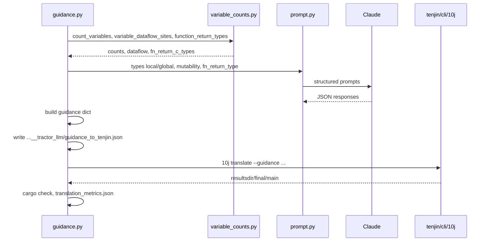

# TenjinGuidance `src/` — pipeline implementation

## Module map

| Module | Role |
|--------|------|
| `guidance.py` | CLI entry point; orchestrates analysis, LLM calls, `10j translate`, retries |
| `variable_counts.py` | libclang static analysis: variable counts, dataflow sites, C return types |
| `prompt.py` | Anthropic client; assembles prompts; writes `*_user.txt` / `*_response.json` logs |
| `translation_metrics.py` | Post-translation metrics (line scan + `cargo clippy --message-format=json`) |
| `convert_expected_results.py` | One-off utility to convert expected-results text to JSON |

## End-to-end flow (guided mode)



1. **Static analysis** — For each `.c` file under paths in `codebases/codebases.txt`, `variable_counts.py` produces occurrence counts keyed by `(function, variable, C type)`, per-variable def/ref **dataflow sites**, and a map of C function return types.

2. **LLM prompting** — `prompt.py` sends the C source plus structured JSON to Claude using templates in `../prompts/`:
   - `guidance_prompt.txt` — Rust types for locals and globals (separate calls)
   - `mutability_prompt.txt` — `vars_mut` map
   - `fn_return_type_prompt.txt` — Rust return types from C signatures

3. **Guidance assembly** — Responses are merged into one JSON object:

```json
{
  "vars_of_type": { "i32": "main:x", "bool": ["foo:flag", "bar:ok"] },
  "declspecs_of_type": { "usize": "GLOBAL:count" },
  "vars_mut": { "main:x": true },
  "fn_return_type": { "compute": "i32" }
}
```

4. **Tenjin** — `_run_10j_translate` runs from `../tenjin/cli`:

```text
./10j translate --reset-resultsdir --codebase <path> --resultsdir <dir> --guidance '<json>'
```

Paths are resolved from TenjinGuidance’s location: Tenjin is expected at `<parent>/tenjin/cli` (sibling of `TenjinGuidance/`).

5. **Validation loop** — Up to three attempts per file. After each translation, `cargo check` runs on `resultsdir/final/main`. On failure, stderr is fed back into the next LLM round via `compile_errors`. Metrics are saved to `translation_metrics.json`.

LLM artifacts live in `{resultsdir.name}__tractor_llm/` (sibling naming) so Tenjin’s `resultsdir` stays empty until translation starts.

## Calling Tenjin

`_run_10j_translate(codebase, resultsdir, guidance)`:

- `guidance=None` — no `--guidance` flag (empty guidance in Tenjin).
- `guidance` string — JSON literal passed on the command line.

`_ensure_tenjin_cli()` verifies `../tenjin/cli/10j` exists before subprocess invocation.

Tenjin guidance keys are documented in [tenjin/docs/USE.md](../../tenjin/docs/USE.md#guidance).

## CLI reference

Run from `TenjinGuidance/` (or ensure `src/` is on `PYTHONPATH`):

| Flag | Effect |
|------|--------|
| `--codebases PATH` | Manifest of C targets (default: `codebases/codebases.txt`) |
| *(default)* | Same as `--guided` when no mode flag is passed |
| `--guided` | LLM + Tenjin guided pipeline → `tenjin_results/` |
| `--analyze-only` | Variable counts only; no LLM or Tenjin |
| `--tenjinize-only` | Tenjin without guidance → `tenjin_baseline/` |
| `--max-items N` | Limit printed count keys per file |
| `--print-metrics PATH [...]` | Print metrics from a Cargo tree or saved JSON |
| `--metrics-title TEXT` | Title when printing one metrics target |

Default entry point: `python src/guidance.py` → `main()`.

## Retry and feedback

```
attempt 1 → Tenjin → cargo check
  ├─ OK  → save metrics, stop
  └─ fail → compile_errors → attempt 2 (LLM sees stderr)
              ...
attempt 3 → give up if still failing
```

Recorded files under `file_N_attempt_M__tractor_llm/`:

- `01_types_local_*`, `02_types_global_*`, `03_mutability_*`, `04_fn_return_type_*`
- `guidance_to_tenjin.json` — exact JSON sent to Tenjin
- `cargo_check_stderr.txt` — on failure

## Tests

From `TenjinGuidance/`:

```bash
pytest tests/
```

| Test file | Covers |
|-----------|--------|
| `test_variable_dataflow_sites.py` | Dataflow site extraction |
| `test_function_return_types.py` | C return type mapping |
| `test_translation_metrics.py` | Metrics helpers (skips if no snapshot) |
| `test_fn_return_prompt_effectiveness.py` | LLM prompt smoke / comparison |

## Path constants

In `guidance.py`:

```python
_TRACTOR_ROOT = Path(__file__).resolve().parents[1]   # TenjinGuidance/
_UROP_ROOT = _TRACTOR_ROOT.parent                   # <parent>/
_TENJIN_CLI = _UROP_ROOT / "tenjin" / "cli"
```

Guided runs use `_GUIDED_RESULTS_ROOT` (`tenjin_results/file_{N}_attempt_{M}/`).

Baseline runs use `_BASELINE_RESULTS_ROOT` (`tenjin_baseline/file_{N}_without_guidance/`). Keeping these separate avoids Tenjin complaining about a non-empty results directory when switching between guided and unguided workflows on the same machine.
